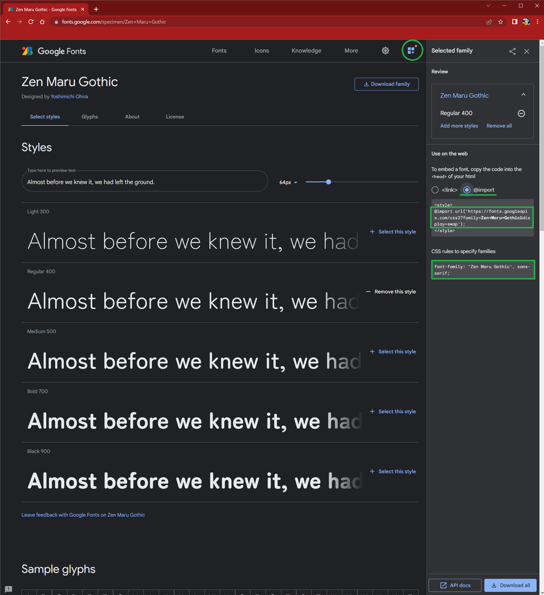

# React プロジェクトで Google Fonts を使う

おしゃれなフォントを見つけたので適用方法をメモ書き

## 1. importコード生成

https://fonts.google.com/

まずは、`Google Fonts`でいい感じのFontを見つけます

見つけたら、`+ Select this style`をクリックします


すると、右側にナビゲーションが出てきます
(出てこない場合は画面上のメニュー内のアイコンをクリック)



## 2. React App で読み込む

React側でCSSを適用させます

1. style.css を作成

style.cssを作成し、ナビゲーションメニューに出てきた
`@import`の部分をコピペします

また、`body`タグの`font-family`をGoogleFontsのFont名にします

```css:style.css
@import url('https://fonts.googleapis.com/css2?family=Zen+Maru+Gothic&display=swap');

body {
  font-family: 'Zen Maru Gothic', sans-serif;
}
```

2. cssを読み込む

作成したcssを、フォント適用させたいコンポーネントでimportします

```tsx:App.tsx
import './style.css';

function App () {
  // 
}
```

完了!